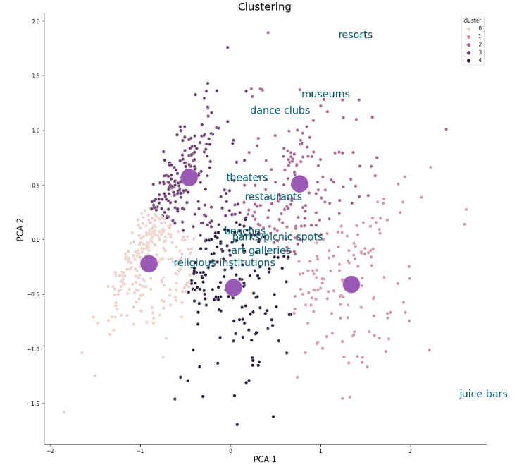

# Traveler Experience Clustering using PCA and KMeans

## Overview
This repository contains code for a clustering model that utilizes Principal Component Analysis (PCA) and KMeans clustering to group traveler reviews based on their feedback on various attributes.
## CLustering



## Dataset
The dataset used for this project includes traveler feedback on the following attributes:
- Average user feedback on art galleries
- Average user feedback on dance clubs
- Average user feedback on juice bars
- Average user feedback on restaurants
- Average user feedback on museums
- Average user feedback on resorts
- Average user feedback on parks/picnic spots
- Average user feedback on beaches
- Average user feedback on theaters
- Average user feedback on religious institutions

## Citations
Renjith,Shini. (2018). Travel Reviews. UCI Machine Learning Repository. https://doi.org/10.24432/C56K6W.

## Clustering Process
1. **Principal Component Analysis (PCA):**
   - Reduce the dimensionality of the dataset using PCA.
   - Select the appropriate number of principal components.

2. **KMeans Clustering:**
   - Apply KMeans clustering algorithm on the reduced dataset.
   - Determine the optimal number of clusters.

4. **Results and Visualization:**
   - Visualize the clusters in a 2D or 3D space.
   - Analyze and interpret the results.


## Dependencies
- Python 3.x
- Required Python libraries: numpy, pandas, scikit-learn, matplotlib, seaborn

## Usage
1. Clone the repository:
   ```bash
   git clone https://github.com/SARDARJI222/Travel_Reviews_Clustering.git
